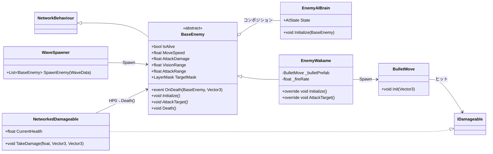
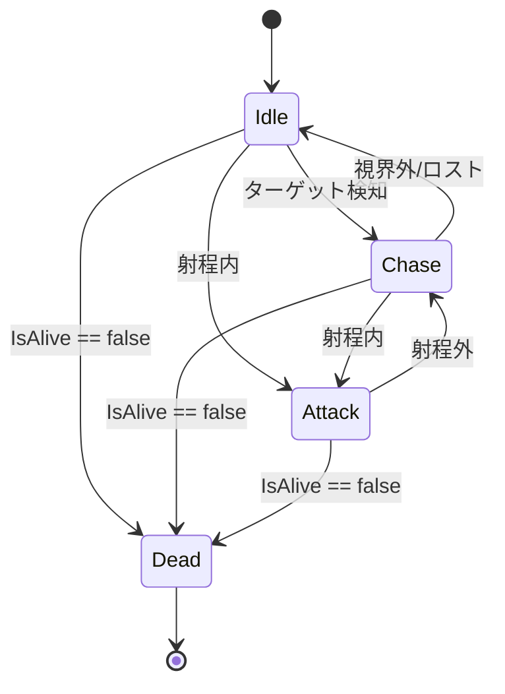
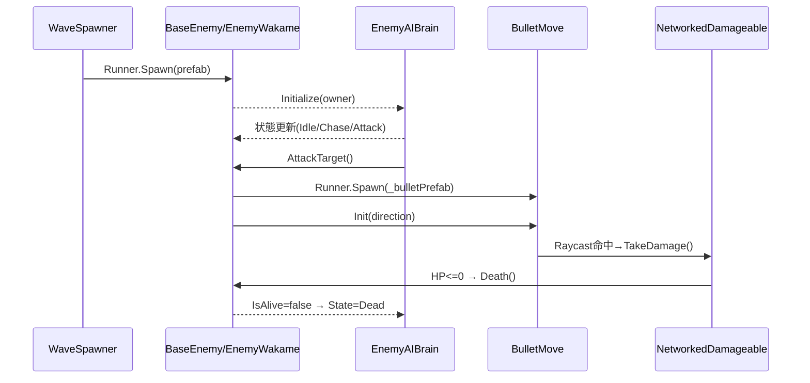

# Enemyフォルダ スクリプト仕様まとめ

本ドキュメントは、現状の `Assets/Scripts/Character/Enemy/` 配下のスクリプト構成と振る舞いを整理したものです。Photon Fusion を用いたネットワーク同期前提で、AI・スポーン・攻撃・被ダメージ・死亡までの流れを俯瞰します。

## 対象ファイル

- `AI/EnemyAIBrain.cs`
- `Core/BaseEnemy.cs`
- `Types/EnemyWakame.cs`
- `Spawning/ WaveSpawner.cs`（先頭にスペースがあるファイル名）

参考（Enemy外だが密接に関係）：
- `Scripts/Bullet/BulletMove.cs`
- `Scripts/Character/NetworkedDamageable.cs`（`IDamageable` を実装）

## 全体像（クラス図）

## 処理フロー

- プレハブ生成（`Runner.Spawn`）
  - `BaseEnemy.Spawned()` が呼ばれ、`IsAlive = true`、`EnemyAIBrain.Initialize(this)` 実行、派生の `Initialize()` を呼び出し
- AI更新（`EnemyAIBrain.FixedUpdateNetwork()`）
  - `State` に応じて `Idle/Chase/Attack/Dead` を遷移
  - 目標検知・追跡・射撃の判断と向きの調整、移動
- 攻撃（例：`EnemyWakame.AttackTarget()`）
  - 弾丸 `BulletMove` を `Runner.Spawn`、`Init()` で初期化
- 弾丸のヒット（`BulletMove`）
  - ラグ補償レイキャストで `IDamageable` を検出→ `TakeDamage()` 呼び出し
- 被ダメージ（`NetworkedDamageable`）
  - `CurrentHealth` 減算、0以下で `BaseEnemy.Death()` 呼び出し
- 死亡
  - `IsAlive = false`、`OnDeath` イベント発火（購読者がいれば波管理などへ通知可能）

### AI状態遷移図（`EnemyAIBrain`）

## 各クラスの役割と主要API

### `Core/BaseEnemy`

- 役割: 全敵の抽象基底。基本ステータス・ネットワーク同期・AI連携・死亡通知を提供
- 主要メンバー
  - フィールド: `_maxHealth`, `_moveSpeed`, `_attackDamage`, `_visionRange`, `_attackRange`, `_targetMask`
  - `[Networked]` プロパティ: `IsAlive`
  - 参照: `_enemyAI`（`EnemyAIBrain`）
  - イベント: `OnDeath(BaseEnemy, Vector3)`
  - 抽象メソッド: `Initialize()`, `AttackTarget()`
  - メソッド: `Spawned()`, `Death()`
- ポイント
  - ネットワーク生成時に AI を初期化し、その後派生の初期化を呼ぶ
  - `[Networked]` は Fusion 同期対象。値の更新は StateAuthority 側で行う

### `AI/EnemyAIBrain`

- 役割: 敵の行動決定。ターゲット探索・追跡・攻撃・死亡待機
- 主要メンバー
  - `enum AIState { Idle, Chase, Attack, Dead }`
  - `[Networked]` `AIState State`, `NetworkObject TargetRef`
  - タイマー: `_reacquireTimer`, `_attackCooldown`（`TickTimer`）
  - `Initialize(BaseEnemy owner)`、`FixedUpdateNetwork()`、`UpdateIdle/Chase/Attack()`
- ロジック概要
  - `Idle`: 周期探索→見つけたら距離で `Chase/Attack` へ
  - `Chase`: 方向回頭＋前進。視界外で `Idle`、射程内で `Attack`
  - `Attack`: 方向回頭＋`AttackTarget()` 実行。クールダウン（既定1.0秒）

### `Types/EnemyWakame`

- 役割: 直線射撃タイプの具体敵
- 主要メンバー
  - 弾プレハブ: `_bulletPrefab : BulletMove`
  - 射撃レート: `_fireRate`
  - `[Networked]` `_fireTimer : TickTimer`
  - ターゲット探索: `SearchTarget()`（`_targetMask` で OverlapSphere）
  - 回頭: `DoRotation()`
  - 攻撃: `AttackTarget()` → `Runner.Spawn` で弾を生成し `Init()` 実行
- 補足
  - `FixedUpdateNetwork()` は StateAuthority のみで動作

### `Spawning/ WaveSpawner`

- 役割: ウェーブ単位の敵生成
- API: `List<BaseEnemy> SpawnEnemy(WaveData waveData)`
  - `waveData.EnemyPrefabs` を `Runner.Spawn` して返す（`WaveData` 定義は未確認）

### 参考：弾丸と被ダメージ

- `BulletMove`
  - `[Networked]` `life`, `lifeTime`, `Speed`
  - `Init()` で `life = TickTimer.CreateFromSeconds(Runner, lifeTime)`、向き設定
  - `FixedUpdateNetwork()` で前進とラグ補償レイキャスト（`LagCompensation.Raycast`）
  - 命中時に `IDamageable.TakeDamage()`、自身は `Runner.Despawn`
- `NetworkedDamageable : IDamageable`
  - `[Networked]` `CurrentHealth`
  - `TakeDamage()` でヘルス減算し 0 以下で `BaseEnemy.Death()`

## インスペクター設定の目安

- `BaseEnemy`（派生側のプレハブに付与）
  - `_visionRange` と `_attackRange` は `EnemyAIBrain` の参照値
  - `_targetMask` はターゲットレイヤー（プレイヤー/艦など）
- `EnemyWakame`
  - `_bulletPrefab` に `BulletMove` を持つネットワークプレハブを割当
  - `_fireRate` は秒間発射数
- `BulletMove`（プレハブ側で）
  - `_targetLayerMask` に命中対象レイヤー

## 既知の注意点・改善候補（現状コード）

- `BaseEnemy.Spawned()`
  - `if(_enemyAI = null)` は代入になっているため比較に修正が必要（`== null`）
- 弾丸寿命と速度
  - `BulletMove.Init()` は `[Networked]` の `lifeTime` を使用して寿命タイマーを開始しますが、現状 `lifeTime`/`Speed` を設定する箇所が見当たりません。プレハブや生成時に値を与えないと即時消滅・停止の恐れがあります
    - 対応例: 弾プレハブに初期値を与える、または `Runner.Spawn` 後に RPC/`Runner.SetActiveScene` 前提で値を設定
- `EnemyWakame.SearchTarget()`
  - 最後に見つかったコライダを採用しているため最近傍にならない場合があります。最近傍選択にすると安定
- `Spawning/ WaveSpawner.cs`
  - ファイル名の先頭にスペースがあるため、環境によっては扱いにくい可能性
  - `WaveData` 定義がプロジェクト内で未確認。構造とアセット配置の再確認推奨
- イベント `BaseEnemy.OnDeath`
  - 現状の購読箇所は未確認。スコア加算・ウェーブ管理・ドロップ処理などが必要であれば購読者を用意

## 想定ライフサイクル（簡易シーケンス）

---

このドキュメントは現状コードの読み取りに基づくものです。設計・実装の修正に合わせて随時アップデートしてください。

