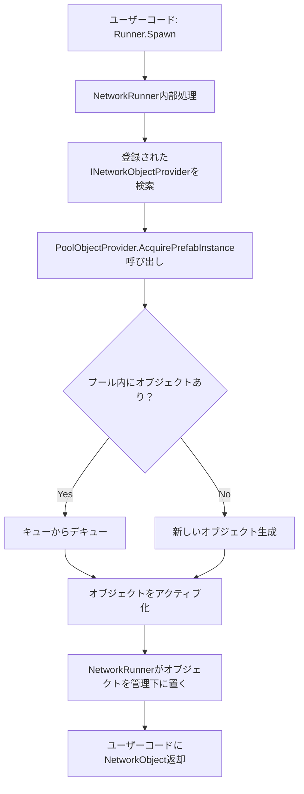
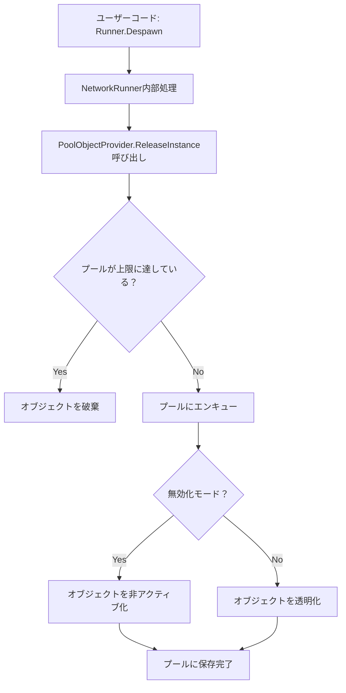

# Fusion Object Pooling 解説

## 概要

このプロジェクトは、Photon Fusionにおけるオブジェクトプールシステムの実装例を示しています。オブジェクトプールとは、オブジェクトの生成・削除のコストを削減するため、一度作成したオブジェクトを再利用する仕組みです。

## 主要なコンポーネント

### 1. PoolObjectProvider.cs
オブジェクトプールの中核となるクラスで、`INetworkObjectProvider`インターフェースを実装しています。

#### 主要な機能：
- **オブジェクトの取得**: `AcquirePrefabInstance()`
- **オブジェクトの返却**: `ReleaseInstance()`
- **プール管理**: プレファブIDごとにQueue（キュー）でオブジェクトを管理

#### プールの仕組み：
```csharp
private Dictionary<NetworkPrefabId, Queue<NetworkObject>> _free = 
    new Dictionary<NetworkPrefabId, Queue<NetworkObject>>();
```

1. **取得時の処理** (`InstantiatePrefab`):
   - プール内に利用可能なオブジェクトがあるかチェック
   - あれば、キューからデキューして再利用
   - なければ、新しいオブジェクトを生成

2. **返却時の処理** (`DestroyPrefabInstance`):
   - プールの上限に達していなければ、オブジェクトをキューにエンキュー
   - 上限に達している場合は、オブジェクトを削除

#### プール内オブジェクトの状態管理：
- **無効化モード**: オブジェクトを非アクティブにする
- **透明化モード**: オブジェクトを半透明にし、物理演算を無効化（デモ用）

### 2. ObjectSpawner.cs
ネットワークオブジェクトの生成・削除を管理するクラスです。

#### 主要な機能：
- **SpawnSphere()**: 球体オブジェクトの生成
- **SpawnCube()**: 立方体オブジェクトの生成
- **DespawnAll()**: 生成したすべてのオブジェクトの削除

#### 重要なポイント：
- サーバーのみがオブジェクトの生成・削除を実行
- `Runner.Spawn()`を呼び出すことで、NetworkRunnerがオブジェクト生成を処理
- NetworkRunnerは自動的に登録された`INetworkObjectProvider`を呼び出す

### 3. CanvasSampleController.cs
UIとオブジェクトプールの統合を管理するコントローラークラスです。

#### 主要な機能：
- セッション前後のUI切り替え
- プール設定の動的変更
- オブジェクト生成・削除のボタン処理

### 4. RandomColor.cs
生成されたオブジェクトにランダムな色を設定するコンポーネントです。

#### ネットワーク同期：
```csharp
[Networked] private Color _color { get; set; }
```
- 色情報がネットワーク全体で同期される
- State Authority（状態権限）を持つクライアントが色を決定

## Fusionのインターフェース連携システム

### INetworkObjectProviderの役割
NetworkRunnerは、オブジェクトの生成・削除時に`INetworkObjectProvider`インターフェースを実装したクラスを自動的に呼び出します。

```csharp
public class PoolObjectProvider : Fusion.Behaviour, INetworkObjectProvider
{
    // INetworkObjectProviderの実装により、NetworkRunnerから自動呼び出し
    public NetworkObjectAcquireResult AcquirePrefabInstance(...)
    public void ReleaseInstance(...)
}
```

### インターフェース連携フロー

#### オブジェクト生成時：


#### オブジェクト削除時：


### プロバイダー登録方法
```csharp
// NetworkRunnerにINetworkObjectProviderを登録
runner.AddBehaviour<PoolObjectProvider>();
// または
runner.gameObject.AddComponent<PoolObjectProvider>();
```

## 設定可能なパラメータ

### プールサイズ制限
```csharp
private int _maxPoolCount = 0;
```
- 0以下: 無制限でプールに保存
- 正の値: 指定された数まで保存、超過分は破棄

### プール内オブジェクトの扱い
```csharp
private bool _disableObjectInPool = true;
```
- `true`: オブジェクトを非アクティブ化
- `false`: オブジェクトを透明化（デモ用）

## パフォーマンスのメリット

1. **メモリアロケーションの削減**: オブジェクトの再利用により、新規生成を削減
2. **ガベージコレクションの負荷軽減**: 削除されるオブジェクトが減少
3. **初期化コストの削減**: すでに初期化済みのオブジェクトを再利用

## 使用方法

1. `PoolObjectProvider`をNetworkRunnerにアタッチ
2. UI経由でオブジェクトの生成・削除を実行
3. プール設定を動的に変更可能

## 実装時の重要なポイント

### インターフェース実装の必須メソッド
```csharp
public interface INetworkObjectProvider
{
    // オブジェクト生成時に呼ばれる
    NetworkObjectAcquireResult AcquirePrefabInstance(
        NetworkRunner runner, 
        in NetworkPrefabAcquireContext context, 
        out NetworkObject instance);
    
    // オブジェクト削除時に呼ばれる
    void ReleaseInstance(
        NetworkRunner runner, 
        in NetworkObjectReleaseContext context);
    
    // プレファブIDの取得
    NetworkPrefabId GetPrefabId(
        NetworkRunner runner, 
        NetworkObjectGuid prefabGuid);
}
```

### 自動呼び出しの仕組み
1. **NetworkRunnerがコンポーネントをスキャン**
2. **INetworkObjectProviderを実装しているクラスを自動登録**
3. **`Runner.Spawn()`時に登録されたプロバイダーを呼び出し**
4. **`Runner.Despawn()`時に登録されたプロバイダーを呼び出し**

## 他プロジェクトへの移植手順

### 1. 必要ファイルのコピー
```
PoolObjectProvider.cs → あなたのプロジェクト
```

### 2. サンプル固有コードの削除
```csharp
// 以下のRigidbody処理はサンプル専用なので削除
if (result.gameObject.TryGetComponent<Rigidbody>(out var rigidbody))
{
    rigidbody.isKinematic = false;
    rigidbody.detectCollisions = true;
}
```

### 3. NetworkRunnerへの追加
```csharp
// NetworkRunnerのあるGameObjectにPoolObjectProviderを追加
networkRunner.gameObject.AddComponent<PoolObjectProvider>();
```

### 4. 使用方法
```csharp
// 通常通りRunner.Spawn()を呼ぶだけ
var spawnedObject = Runner.Spawn(prefab, position, rotation);

// 自動的にPoolObjectProviderが呼び出される
```

## 注意点

- サンプルコードには、Rigidbodyの状態変更などゲーム固有の処理が含まれています
- 実際のプロダクションコードでは、このようなゲーム固有の処理は削除してください
- プールサイズは適切に設定し、メモリ使用量とパフォーマンスのバランスを考慮してください
- `INetworkObjectProvider`は1つのNetworkRunnerにつき1つのみ登録可能です
