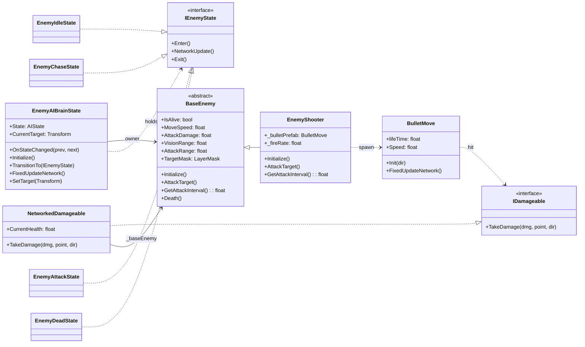
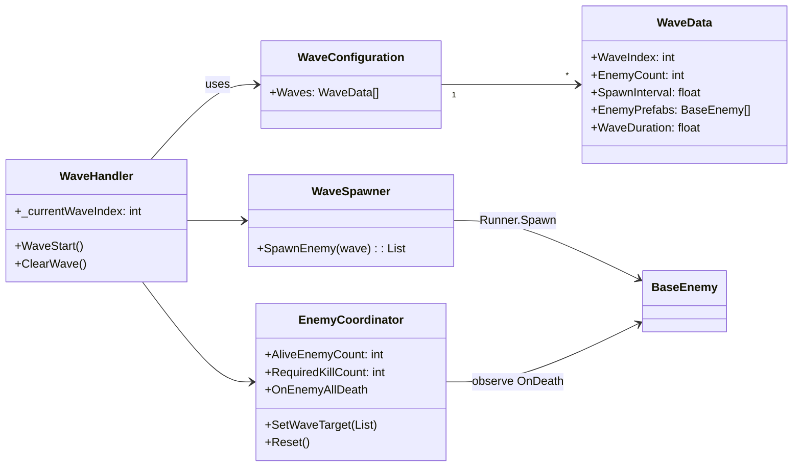

# 敵システム使用ガイド（Photon Fusion / ステートマシン）

この文書は「どう使うか」に特化した手順書です。設計詳細は必要最小限のみ言及します。

## まずはこれ（クイックスタート）

1. 弾プレハブ（`BulletMove`）を作る
   - 空のプレハブに以下を追加
     - `NetworkObject`
     - `BulletMove`
   - `BulletMove` の Inspector 設定
     - `lifeTime`: 弾の寿命（秒）
     - `Speed`: 弾速
     - `_targetLayerMask`: 命中対象のレイヤー
   - NetworkProjectConfig の `NetworkPrefabs` に登録

2. 敵プレハブ（例: `EnemyShooter`）を作る
   - 空のプレハブに以下を追加
     - `NetworkObject`
     - `EnemyAIBrainState`（`Scripts/Character/Enemy/AI/EnemyAIBrainState.cs`）
     - `EnemyShooter`（`Scripts/Character/Enemy/Types/EnemyShooter.cs`）
     - `NetworkedDamageable`（`Scripts/Character/NetworkedDamageable.cs`）
   - Inspector の主な設定
     - `BaseEnemy` 派生（`EnemyShooter`）
       - `_maxHealth`, `_moveSpeed`, `_attackDamage`, `_visionRange`, `_attackRange`, `_targetMask`
       - `EnemyShooter._bulletPrefab` に 1 の弾プレハブを割り当て
       - `EnemyShooter._fireRate` で攻撃レートを調整（1秒あたり発射数）
     - `NetworkedDamageable._baseEnemy` に同オブジェクトの `EnemyShooter` を割り当て
   - NetworkProjectConfig の `NetworkPrefabs` に登録

3. ウェーブ（出現）設定を用意
   - `Create → Game → Wave Configuration` から `WaveConfiguration` アセットを作成
   - 各 `WaveData` に `EnemyPrefabs` 配列へ 2 の敵プレハブを設定

4. スポーン管理をシーンに配置
   - 空の GameObject に以下を追加
     - `WaveSpawner`（`Scripts/Character/Enemy/Spawning/WaveSpawner.cs`）
     - `EnemyCoordinator`（`Scripts/Core/Wave/EnemyCoordinator.cs`）
     - `WaveHandler`（`Scripts/Core/Wave/WaveHandler.cs`）
   - `WaveHandler._waveConfiguration` に 3 のアセットを割り当て
   - ゲーム進行（`GameState`）が `WaveAction` になると、`WaveHandler` がスポーンを開始

5. 実行して確認
   - 権限（State Authority）側で敵 AI が更新され、射撃・ダメージ・撃破が同期されます

## 必要コンポーネントと役割

- `BaseEnemy`（抽象, `Scripts/Character/Enemy/Core/BaseEnemy.cs`）
  - 共通プロパティと API を提供
  - `[Networked] bool IsAlive` を同期
  - `Initialize()` / `AttackTarget()` を派生で実装
  - `OnDeath(BaseEnemy, Vector3)` イベントで死亡を通知

- `EnemyShooter`（例実装, `Scripts/Character/Enemy/Types/EnemyShooter.cs`）
  - `AttackTarget()` で `Runner.Spawn(_bulletPrefab, ...)` を実行
  - `_fireRate` により `GetAttackInterval()` が 1/_fireRate に

- `EnemyAIBrainState`（`Scripts/Character/Enemy/AI/EnemyAIBrainState.cs`）
  - `[Networked] AIState State { get; }` を公開
  - ステート（`Idle/Chase/Attack/Dead`）を内部生成・管理
  - `HasStateAuthority` のみ `FixedUpdateNetwork()` でステート更新
  - `OnStateChanged(prev, next)` により表示側へ通知可能

- ステート群（`Scripts/Character/Enemy/AI/States/`）
  - `EnemyIdleState`: 一定間隔で索敵（0.5s）。視界内→`Chase`、射程内→`Attack`
  - `EnemyChaseState`: ターゲットへ回頭・前進。射程内→`Attack`、視界外→`Idle`
  - `EnemyAttackState`: 回頭してクールダウンごとに `owner.AttackTarget()` 実行。射程外→`Chase`
  - `EnemyDeadState`: 停止

- 弾丸（`Scripts/Bullet/BulletMove.cs`）
  - `lifeTime`・`Speed` をネットワーク同期
  - `LagCompensation.Raycast` で命中検出し、`IDamageable.TakeDamage` を呼ぶ

- ダメージ（`Scripts/Character/NetworkedDamageable.cs`）
  - `[Networked] CurrentHealth`
  - `TakeDamage` でヘルスを減算し 0 以下で `BaseEnemy.Death()` を呼ぶ

- ウェーブ管理
  - `WaveConfiguration`（`Scripts/Core/Wave/WaveConfiguration.cs`）: 出現テーブル
  - `WaveSpawner`（`Scripts/Character/Enemy/Spawning/WaveSpawner.cs`）: プレハブを `Runner.Spawn`
  - `EnemyCoordinator`（`Scripts/Core/Wave/EnemyCoordinator.cs`）: 生存数を同期・全滅検知
  - `WaveHandler`（`Scripts/Core/Wave/WaveHandler.cs`）: ゲーム状態に応じて Wave 開始/終了

## クラス図

### 敵AI（行動/攻撃）

### ウェーブ/スポーン連携

## アニメーション連携（任意）

- `EnemyAIBrainState.OnStateChanged(prev, next)` を購読し、`Animator` の再生を切り替えます
- 例: `Idle → Idle`, `Chase → Run`, `Attack → Attack Trigger`, `Dead → Die`

## 設定ガイド（主な Inspector 項目）

- 敵（`BaseEnemy` 派生）
  - `_maxHealth`: 初期HP（`NetworkedDamageable` 側の `_maxHealth` と混同注意）
  - `_moveSpeed`: 前進速度（`Chase` で使用）
  - `_attackDamage`: 参考値（現状の与ダメは弾側の `_damage`）
  - `_visionRange`: 索敵距離（`Idle`）
  - `_attackRange`: 攻撃移行距離（`Attack` 判定）
  - `_targetMask`: 索敵対象レイヤー

- `EnemyShooter`
  - `_bulletPrefab`: `BulletMove` を持つプレハブ
  - `_fireRate`: 1秒あたりの発射回数（`Attack` クールダウンに反映）

- `BulletMove`
  - `lifeTime`: 弾寿命（秒）
  - `Speed`: 弾速
  - `_targetLayerMask`: 命中対象のレイヤー

- `NetworkedDamageable`
  - `_baseEnemy`: 同一オブジェクトの `BaseEnemy` 参照
  - `_maxHealth`: ネット同期される実体 HP 初期値

- `WaveConfiguration`
  - 各 `WaveData` の `EnemyPrefabs[]` に敵プレハブを追加
  - `WaveDuration`: ウェーブ持続時間（経過でもクリア）

## よくあるハマりどころ（チェックリスト）

- NetworkProjectConfig の `NetworkPrefabs` に「敵」と「弾」を登録していない
- 弾プレハブに `NetworkObject` が無い／`lifeTime`・`Speed` 未設定
- `NetworkedDamageable._baseEnemy` 未割り当て
- 敵側の `_targetMask` 不一致で索敵できない（`Idle` から動かない）
- 権限外で `AttackTarget()` を呼んでいる（AI更新は `HasStateAuthority` のみ）
- `WaveSpawner` は現在 `Vector3.up` にスポーンする実装（任意でスポーン位置ロジックを拡張してください）

## 拡張方法（新しい敵タイプの追加）

1. `BaseEnemy` を継承した新クラスを `Scripts/Character/Enemy/Types/` に作成
2. `Initialize()`・`AttackTarget()` を実装（必要に応じて `GetAttackInterval()` も調整）
3. 新しいプレハブを作成し、`EnemyAIBrainState`・`NetworkedDamageable` を付与
4. `WaveConfiguration` の `EnemyPrefabs[]` に追加
5. アニメーションを使う場合は `OnStateChanged` を購読して切り替え

## 簡易仕様メモ（実装寄り）

- ステート更新は `EnemyAIBrainState.FixedUpdateNetwork()`（権限側のみ）
- 索敵は `Physics.OverlapSphere`（距離のみ）
- 攻撃間隔は `TickTimer`（`GetAttackInterval()` ベース）
- 撃破時は `BaseEnemy.OnDeath` → `EnemyCoordinator` が全滅監知して Wave 終了へ

---

最終更新: 実装の使用方法に合わせて内容を刷新