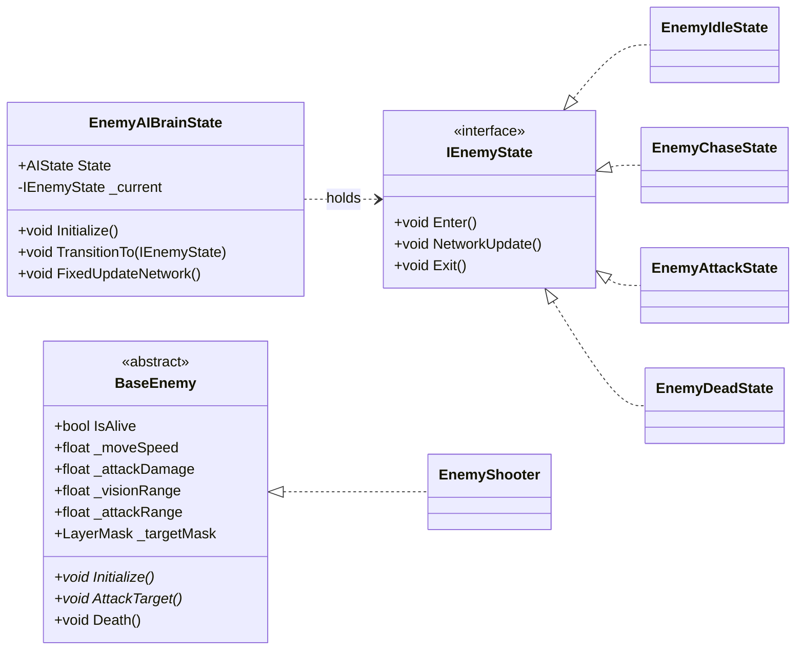
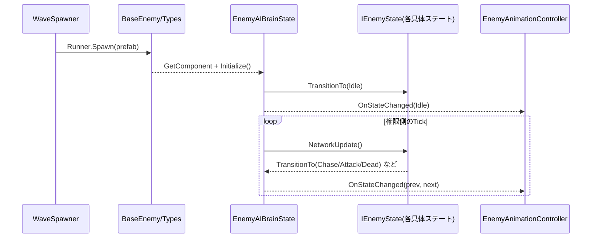

# 敵システム仕様書（ステートマシン対応）

このドキュメントは、敵AIをステートマシン方式に刷新した設計仕様を示します。各挙動は「状態」単位の独立スクリプトで実装され、`EnemyAIBrainState` が現在状態の管理・遷移・更新を担当します。

## 📁 フォルダ構造

```
Enemy/
├── AI/
│   ├── EnemyAIBrainState.cs      # ステートマシン本体
│   └── States/                   # 具体ステート群（提案）
│       ├── EnemyIdleState.cs
│       ├── EnemyChaseState.cs
│       ├── EnemyAttackState.cs
│       └── EnemyDeadState.cs
├── Combat/
├── Core/
├── Spawning/
└── Types/
```

## 🏗️ アーキテクチャ概要

1. **BaseEnemy**: すべての敵の抽象基底。移動・攻撃APIと共通プロパティを提供
2. **EnemyAIBrainState**: ステートマシン。`IEnemyState` を保持しネットワーク権限下で更新
3. **IEnemyState + 具体ステート**: `Enter/NetworkUpdate/Exit` を実装する振る舞い単位のクラス
4. **WaveSpawner / EnemyCoordinator**: スポーンと撃破管理（従来通り）



## 📋 コンポーネント仕様

### BaseEnemy（基底クラス）
**ファイル**: `Core/BaseEnemy.cs`

- Fusionの `NetworkBehaviour` を継承
- 主要プロパティ: `_maxHealth`, `_moveSpeed`, `_attackDamage`, `_visionRange`, `_attackRange`, `_targetMask`, `[Networked] IsAlive`
- ライフサイクル: `Spawned()` 内で `IsAlive=true`、`EnemyAIBrainState` 取得後に `Initialize()` を呼ぶ
- 抽象API: `Initialize()`, `AttackTarget()`

### EnemyAIBrainState（ステートマシン本体）
**ファイル**: `AI/EnemyAIBrainState.cs`

- `[Networked] AIState State { get; }` を公開（同期用の状態列挙）
- 内部に `IEnemyState _current` を保持し、権限側のみ `NetworkUpdate()` を呼ぶ
- ステート遷移時にアニメーション管理へ通知する `OnStateChanged(AIState prev, AIState next)` を提供
- 代表API

```csharp
public interface IEnemyState {
    void Enter();
    void NetworkUpdate();
    void Exit();
}

public sealed class EnemyAIBrainState : NetworkBehaviour {
    public enum AIState { Idle, Chase, Attack, Dead }

    [Networked] public AIState State { get; private set; }

    public event System.Action<AIState, AIState> OnStateChanged; // prev, next

    private IEnemyState _current;
    // 必要なら各ステートのインスタンスを生成・キャッシュ
    public IEnemyState Idle  { get; private set; }
    public IEnemyState Chase { get; private set; }
    public IEnemyState Attack{ get; private set; }
    public IEnemyState Dead  { get; private set; }

    public void Initialize() {
        // ステート生成・初期遷移
        State = AIState.Idle;
        TransitionTo(Idle);
    }

    public void TransitionTo(IEnemyState next) {
        if (_current == next) return;
        // Exit/Enter は初期化・後始末のみ行う（重い処理や攻撃は NetworkUpdate で実施）
        _current?.Exit();
        _current = next;
        _current?.Enter();
    }

    public override void FixedUpdateNetwork() {
        if (!HasStateAuthority) return;
        _current?.NetworkUpdate();
    }
}
```

- Enter/Exit ルール
  - Enter/Exit は「初期化／後始末のみ」を行う。例: タイマー初期化、フラグ設定、アニメーション切替要求
  - ネットワーク生成・弾発射・ダメージ判定などの本処理は必ず `NetworkUpdate()` 内で行う
  - 1tick を跨ぐ処理は `NetworkUpdate()` で継続させる

### 具体ステート（例）

- 共通前提
  - それぞれ `EnemyAIBrainState` と `BaseEnemy` への参照を保持
  - 更新は `EnemyAIBrainState.FixedUpdateNetwork()` から `NetworkUpdate()` が呼ばれる
  - 遷移は各ステートの内部ロジックから `machine.TransitionTo(...)` を呼び出して行う（図の State.cs が Brain の状態を変更する）

- IdleState
  - 一定間隔で索敵（`_visionRange`、`_targetMask`）
  - 射程内: AttackState へ／視界内: ChaseState へ／ロスト: Idle継続

- ChaseState
  - ターゲットへ回頭して `_moveSpeed` で前進
  - 射程内なら AttackState、視界外なら IdleState へ

- AttackState
  - ターゲットへ回頭し `BaseEnemy.AttackTarget()` を呼ぶ
  - `TickTimer` で攻撃クールダウンを管理
  - 射程外で ChaseState へ

- DeadState
  - 入場時に移動/攻撃を停止。更新は基本なし

## 🔄 データフロー（更新）



## ⚡ ネットワーク方針

- ステート更新は `HasStateAuthority == true` のランナーのみ実行
- 表示に必要な軽量情報は `[Networked]` で同期（例: `AIState State`）
- 射撃などネットワークオブジェクト生成は `Runner.Spawn()` を使用

## 🎞 アニメーション制御

- 目的: ステート遷移に応じてアニメーションを一元管理
- クラス: `EnemyAnimationController`（提案。`Animator` をラップ）
- 配置: 敵プレハブにアタッチし、`EnemyAIBrainState` から通知を受ける
- 連携方法
  - `EnemyAIBrainState` は `OnStateChanged(prev, next)` を発火
  - `EnemyAnimationController` はこのイベントを購読して、`next` に応じて `PlayIdle/PlayRun/PlayAttack/PlayDie` を呼ぶ
- 代表API（例）

```csharp
public sealed class EnemyAnimationController : MonoBehaviour {
    [SerializeField] private Animator _animator;
    public void PlayIdle()   => _animator.Play("Idle");
    public void PlayRun()    => _animator.Play("Run");
    public void PlayAttack() => _animator.SetTrigger("Attack");
    public void PlayDie()    => _animator.Play("Die");
}

// Brain 側（TransitionTo内や状態変更時）
OnStateChanged?.Invoke(prev, next);
```

## 🧩 `EnemyWakame` → 新名称で再作成

- 現在の `EnemyWakame` は名称が不適切なため廃止し、機能ベース名の新クラスを作成します。
- 新クラス名の提案: `EnemyShooter`（直線射撃に特化）
- ファイル: `Types/EnemyShooter.cs` を新規作成し、`BaseEnemy` を継承
- 役割: 弾生成と射撃レート管理のみを担当（行動判断はステート側）
- 移行手順
  - `WaveConfiguration` で参照しているプレハブを `EnemyShooter` に差し替え
  - スポーン箇所（`WaveSpawner` 等）での型依存があれば `BaseEnemy` に統一
  - 旧 `EnemyWakame` は削除または非アクティブ化

AttackState から `owner.AttackTarget()` を呼び、`BulletMove` を `Runner.Spawn` します（抜粋）。

```csharp
// EnemyWakame.AttackTarget()
var dir = (target.position - transform.position).normalized;
var bullet = Runner.Spawn(_bulletPrefab, transform.position + dir * 2, Quaternion.LookRotation(dir));
bullet.Init(dir);
```

## 🛠 実装ガイド

1. `AI/States/` を作成し、`IEnemyState` と各ステートを配置
2. `EnemyAIBrainState.Initialize()` で各ステートを生成し、初期遷移を実施（Enter/Exit は初期化・後始末のみ）
3. ステート内で `BaseEnemy` のAPI（移動・攻撃）を呼ぶ
4. 遷移条件は「距離」「視界」「生存」の3軸を基準に統一し、ステート自身が `TransitionTo()` を呼ぶ
5. `EnemyAnimationController` を配置し、`OnStateChanged` を購読してアニメ再生を切り替える

## ✅ 完了条件（受け入れ基準）

- 状態は `Idle/Chase/Attack/Dead` の4種を最低限提供
- 権限側のみで `NetworkUpdate()` が実行されること
- `AIState` の値がクライアント間で同期されUI/デバッグで観測可能
- `EnemyWakame` が AttackState 経由で射撃できること

## 📌 参考：クラス命名ポリシー（敵タイプ）

- 機能ベース: `EnemyShooter`, `EnemyCharger`, `EnemyBomber`
- 行動+武器: `EnemyKelpShooter`（現`EnemyWakame`に近い）, `EnemyTurret`
- 階層を保つ場合は `Types/` 配下で `Enemy<Behavior>` に統一

---

作成日: 2024年／最終更新: ステートマシン方式に刷新