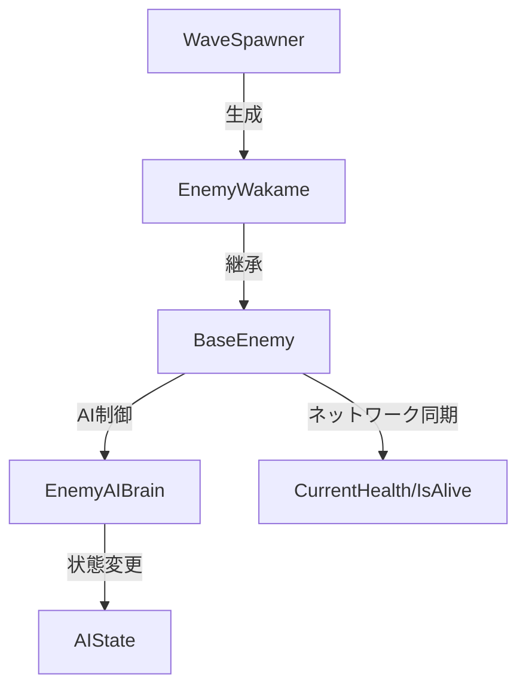

# 敵システム仕様書

このドキュメントでは、現在実装されている敵システムの構造と各コンポーネントの役割について説明します。

## 📁 フォルダ構造

```
Enemy/
├── AI/              # 敵のAI制御
├── Combat/          # 戦闘システム（現在空）
├── Core/            # 基底クラス
├── Spawning/        # 敵のスポーン管理
└── Types/           # 具体的な敵の種類
```

## 🏗️ アーキテクチャ概要

敵システムは以下の3つの主要コンポーネントで構成されています：

1. **BaseEnemy** - すべての敵の基底クラス
2. **EnemyAIBrain** - AI行動制御
3. **WaveSpawner** - 敵のスポーン管理

## 📋 各コンポーネント詳細

### BaseEnemy（基底クラス）
**ファイル**: `Core/BaseEnemy.cs`

```csharp
public abstract class BaseEnemy : NetworkBehaviour
```

#### 機能
- **ネットワーク対応**: Fusion NetworkBehaviourを継承
- **基本ステータス管理**: HP、移動速度、攻撃力
- **ネットワーク同期**: CurrentHealth、IsAliveをネットワーク経由で同期

#### 主要プロパティ
| プロパティ | 型 | 説明 |
|------------|----|----- |
| `_maxHealth` | float | 最大HP（デフォルト: 100） |
| `_moveSpeed` | float | 移動速度（デフォルト: 3） |
| `_attackDamage` | float | 攻撃力（デフォルト: 10） |
| `CurrentHealth` | float | 現在のHP（ネットワーク同期） |
| `IsAlive` | bool | 生存状態（ネットワーク同期） |

#### 抽象メソッド
- `Initialize()` - 敵固有の初期化処理
- `AttackTarget()` - 攻撃実行処理

### EnemyAIBrain（AI制御）
**ファイル**: `AI/EnemyAIBrain.cs`

```csharp
public class EnemyAIBrain : NetworkBehaviour
```

#### AI状態
```csharp
enum AIState
{
    Idle,    // 待機
    Patrol,  // 巡回
    Chase,   // 追跡
    Attack,  // 攻撃
    Flee     // 逃走
}
```

#### 主要メソッド
- `ApproachBattleship()` - 戦艦への接近
- `ExecuteAttack()` - 攻撃実行
- `HandleRetreat()` - 撤退処理

> ⚠️ **注意**: 現在はメソッドのスケルトンのみ実装されており、具体的なロジックは未実装

### WaveSpawner（スポーン管理）
**ファイル**: `Spawning/ WaveSpawner.cs`

```csharp
public class WaveSpawner : NetworkBehaviour
```

#### 機能
- **敵のスポーン**: 指定位置への敵の生成
- **ウェーブ管理**: ウェーブシステムの制御
- **難易度調整**: ウェーブごとの難易度設定

#### 主要設定
| 設定項目 | 型 | 説明 |
|----------|----|----- |
| `_enemyPrefab` | GameObject | スポーンする敵のプレハブ |
| `_spawnPosition` | Vector3 | 敵の初期スポーン位置 |

#### メソッド
- `SpawnEnemy()` - 敵の生成
- `StartWave(int waveIndex)` - ウェーブ開始
- `CheckWaveCompletion()` - ウェーブ完了判定

### EnemyWakame（敵の実装例）
**ファイル**: `Types/EnemyWakame.cs`

```csharp
public class EnemyWakame : BaseEnemy
```

#### 現在の実装
- 基本的な前進移動のみ実装
- `Initialize()`と`AttackTarget()`は空実装

```csharp
public override void FixedUpdateNetwork()
{
    if (!HasStateAuthority) return;
    transform.position += transform.forward * Runner.DeltaTime;
}
```

## 🔄 データフロー



## ⚡ ネットワーク対応

このシステムはFusion NetworkingFrameworkを使用しており、以下の機能が提供されています：

- **ネットワーク同期**: 敵の状態がマルチプレイヤー間で同期
- **権限管理**: `HasStateAuthority`による処理権限制御
- **ネットワークスポーン**: `Runner.Spawn()`による敵の生成

## 🚧 実装状況

### ✅ 実装済み
- 基底クラス（BaseEnemy）の骨格
- AI状態の定義
- 基本的なスポーン機能
- ネットワーク同期の準備

### ⏳ 未実装・要開発
- AI行動ロジックの具体的な実装
- 戦闘システム（Combatフォルダは空）
- ウェーブ管理の詳細機能
- 敵の種類の多様化
- アニメーション連携
- サウンド効果

## 📝 開発時の注意点

### 新しい敵を作成する場合
1. `BaseEnemy`を継承したクラスを`Types/`フォルダに作成
2. `Initialize()`と`AttackTarget()`を実装
3. 必要に応じて`FixedUpdateNetwork()`をオーバーライド

### AI行動を実装する場合
1. `EnemyAIBrain`の各メソッドに具体的なロジックを実装
2. `AIState`に応じた行動パターンを定義
3. ターゲット（戦艦）への参照を適切に設定

### ネットワーク対応
- 状態変更は`HasStateAuthority`をチェック
- ネットワーク同期が必要なプロパティには`[Networked]`属性を追加
- スポーンは`Runner.Spawn()`を使用

## 🎯 今後の拡張案

1. **戦闘システムの実装**
   - ダメージ計算
   - 攻撃エフェクト
   - 死亡処理

2. **AI行動の充実**
   - プレイヤー追跡
   - 戦艦への集中攻撃
   - 回避行動

3. **ウェーブシステムの拡張**
   - 動的難易度調整
   - 複数種類の敵の混合スポーン
   - ボス敵の実装

4. **パフォーマンス最適化**
   - オブジェクトプール
   - LODシステム
   - 不要なオブジェクトの自動削除

---

**作成日**: 2024年
**最終更新**: システム調査完了時点